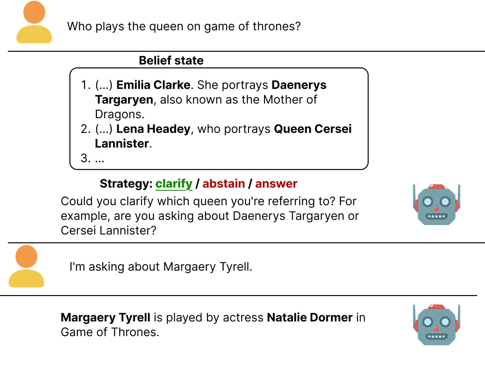
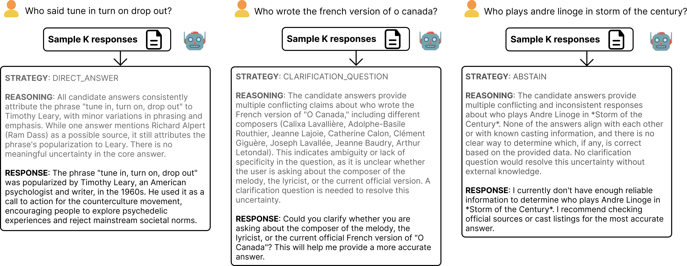

# Clarify, Abstain or Answer? Strategising in Conversation with Belief-Augmented Generation

Code for the paper: [Clarify, Abstain or Answer? Strategising in Conversation with Belief-Augmented Generation](https://arxiv.org/pdf/2605.25831) to appear at INLG 2026.

Please consider citing us if you find this project useful.



# Belief-Augmented Generation (BAG)
**Belief-Augmented Generation (BAG)** is a training-free method that:
1. Samples K generations to a user's question — the *belief state*. This is a textual representation of a model's probabilistic uncertainty. 
2. Prompts the same model with this belief state and asks it to reason about and choose a conversational strategy that best addresses its own uncertainty. We experiment with three conversational strategies: **direct answer**, **clarification question**, or **abstain**. You can adjust the available strategies (e.g., to include tool-calling or RAG) and instructions (when to pick one strategy over the other) in `prompts.py`. We prompt BAG to output a reasoning trace, the chosen strategy, and the corresponding user-facing response (e.g., the actual clarification question, direct answer, or abstain response).


 
# Data and setting
Since we allow a clarification as a conversational strategy, we evaluate BAG in an interactive, multi-turn ambiguous question answering (QA) setting using [AmbigQA](https://nlp.cs.washington.edu/ambigqa/) in `data/input/ambignq_light/{train,dev}_light.json` — the AmbigQA "light" splits (Min et al. 2020, CC BY-SA 3.0). These are the only inputs the pipeline needs.

We simulate a user asking an underspecified question with with a specific intent via a second LLM. This LLM receives one of the disambiguation annotations from AmbigQA. For instance, the question `"Who is the female singer on Gimme Shelter?"` yields two disambiguated pairs: `"Who was the female singer on the recorded version of Gimme Shelter?" -> Merry Clayton` and `"Who was the female singer on Gimme Shelter on tour?" -> Lisa Fischer`. We treat each disambiguation-answer pair as a separate user intent. This user intent is invisible to the BAG model.
The four turns look like this:
1. User question (from AmbigQA)
2. Assistant response using BAG (direct answer, clarification or abstain)
3. If BAG asks a clarification question, the user simulator response based on AmbigQA annotations.
4. Assistant response conditioned on the previous three turns.

# BAG+
BAG can be run at multiple conversational turns of model-user interaction. We experiment with applying BAG not only to the first turn, but also the fourth: after a clarification interaction with the user. We call this BAG+. We resample another K generations conditioned on the conversation history (turn 1-3). This time, we only allow two strategies: direct answer or abstain, to limit the maximum number of interactions to 1 while still allowing the model to abstain if it doesn't have the required knowledge after all. Again, this is easy to customize in `prompts.py`.

## Requirements

- Python 3.12.
- One CUDA GPU for the open-source models. Local inference uses 8-bit `bitsandbytes` quantisation; a single H100 fits the 7B/13B/14B models used in the paper.
- API keys, stored as plain text in:
  - `~/.secrets/anthropic_api_key` — Claude models (optional; only for the `haiku*` model names)
  - `~/.secrets/google_api_key` — Gemini models (used as the default user simulator and LLM judge)

Install:

```bash
pip install -r requirements.txt
```

## Running the pipeline

Everything runs through `pipeline.py`, which defines and exposes pipeline steps via `--steps`, which can be set to `all` to run the entire pipeline. The pipeline contains the following steps:

```
direct                   K unbiased samples (belief state) + 1 recommended-sampling answer
disambiguated            oracle: answer the human-disambiguated version of the question
reasoner                 pick a strategy given the question and belief state (BAG method) or from the user question alone (SAG baseline)
user                     simulated user answers the clarification question
final                    final answer given the four-turn conversation
                         --final_prompt prompt   = plain forced answer
                         --final_prompt prompt1  = SAG+ (prompt-only augmented generation baseline)
                         --final_prompt belief   = BAG+ (full BAG applied again, resampling K generations, and reasoning over the belief state)
judge                    LLM-judge scoring of generations (--judge_branch direct/disambig/belief/reasoner/final)
claim_variation          belief-state clustering diagnostic
interpretation_variation belief-state scope-marker diagnostic
claim_variation_final    post-clarification belief-state clustering (final_prompt=belief only)
```

Minimal end-to-end example for one model (`qwen3-14b`), BAG prompt 6 (`belief6`) and using BAG a second time during the fourth turn (BAG+; `final_prompt=belief`).

```bash
python pipeline.py \
  --assistant_model qwen3-14b \
  --user_model gemini-2.5-flash \
  --judge_model gemini-2.5-flash \
  --direct_prompt vanilla \
  --reasoner_prompt belief6 \
  --final_prompt belief \
  --belief_sampling unbiased \
  --n_samples 10 \
  --seed 50 \
  --split dev \
  --max_examples 2000 \
  --steps all
```

### Scripts (`script/`)
All experiments were done on a single H100 on a slurm compute cluster. The full model / prompt sweeps used in the paper are in `script/run_pipeline.job`. To launch separate slurm jobs per assistant model in parallel you can use `script/launch.sh`, which internally calls `script/single_pipeline_run.job` (one job per model).

### Outputs

Generations are written to `data/generations{,/dev}/{,test/}<step>_<model>_<...>.jsonl`. Filenames are deterministic and constructed by `config.build_output_fname`; each step also writes a timestamped copy under `timestamped/`. Pipeline steps skip themselves if their output file already exists; pass `--force` to re-run a step.

## Project layout

### Pipeline modules (top level)
Each `<step>.py` module exposes a single `generate_*` function invoked by `pipeline.py`:

| File | Role                                                                                                                                        |
|---|---------------------------------------------------------------------------------------------------------------------------------------------|
| `pipeline.py`         | CLI entry point; runs and manages the whole pipeline, defining individual steps, manages output filenames and I/O                           |
| `config.py`           | `Config` dataclass, valid mode/prompt enums, `build_output_fname`                                                                           |
| `dataloader.py`       | AmbigQA loader, pipeline-output loader, evergreen filter                                                                                    |
| `generation_utils.py` | Handles local HF vs API-based generation, batch-size estimator, model registry                                                              |
| `api_utils.py`        | Anthropic + Gemini clients (sync + batch)                                                                                                   |
| `generate_direct_answer.py`   | Step 1a — sample the belief state and generate a single answer                                                                              |
|                               | Step 1b — generate a single answer for an oracle-disambiguated version of the question                                                      |
| `generate_clarify.py`         | Step 2 — output strategy, reasoning trace, and response given the question and belief state (BAG) or question alone (SAG)                   |
| `generate_user_answer.py`     | Step 3 — Simulated user answer to an assistant model's clarification question                                                               |
| `generate_final_answer.py`    | Step 4 — final assistant answer (`prompt` / `prompt1`=SAG+ / `belief`=BAG+)                                                                 |
| `generate_judge.py`           | LLM judge for any branch, with optional any-ref scoring                                                                                     |
| `generate_faithfulness.py`    | Computes metrics used to assess faithfulness (claim + interpretation variation)                                                             |
| `prompts.py`          | All prompt templates: direct, reasoner (`belief`, `belief1`–`belief9`, `prompt`), user simulator, final-answer variants, judge, diagnostics |
| `parse_utils.py`      | Parsers for every structured LLM output the pipeline emits                                                                                  |
| `evaluation_utils.py` | ROUGE-L and judge-verdict aggregation into per-example metrics                                                                              |
| `gemini_batch_jobs.py`| Utility to list/cancel Gemini batch jobs                                                                                                    |

### Analysis notebooks
`notebooks/` contains the analyses and results.
- `evaluate_bag.ipynb` — main BAG results tables (Table 1,2, Fig 3,4)
- `evaluate_faithfulness.ipynb` — belief-state faithfulness metrics (Fig 5)

Most cells are thin wrappers; the actual logic lives in:
- `notebooks/nb_utils.py` — shared plotting, table building, routing/coverage aggregations
- `notebooks/faithfulness_utils.py` — belief-state faithfulness metrics
- `notebooks/latex_utils.py` — LaTeX table export for the paper

### Visualiser and annotation UI
- `docs/index.html` — self-contained web UI to browse per-question BAG output, judgements and belief states. Serve with `python -m http.server 8000` from the project root; the page expects generations under `data/generations/` or uses the public hf dataset.

## Some details to more easily understand the code
- The `reasoner=belief*` arguments stand for BAG; `reasoner=prompt` stands for SAG. BAG+ is enabled by setting `final_prompt=belief` and SAG+ by setting `final_prompt=prompt1`.
- **Reasoner ↔ final-prompt coupling.** `belief*` reasoners must be paired with `--final_prompt belief` (BAG+); `prompt` reasoners with `--final_prompt prompt` or `prompt1` (SAG / SAG+). `pipeline.py` raises an exception if you mix them.
- **Reference selection is per-item deterministic** (`evaluation_utils.get_item_ref` seeds a `random.Random(item_id)`), so every step and every judge call scores against the same reference for a given question — independent of iteration order or batch size.
- **Belief state extraction.** For direct-answer items the belief state is a list of dicts with `response`/`raw_response` (see `parse_utils.parse_direct_response`); for `final_answer` items with `final_prompt=belief` it is a flat list of raw strings stored at the top level (`item['belief_state']`). `generate_faithfulness._get_belief_samples` and `_get_final_belief_samples` handle the two shapes.
- **Legacy output keys.** Older thinking-model runs stored samples under the key `samples` instead of `answer`. `generate_direct_answer.py` and downstream code fall back to either.
- **API keys must exist on disk** (see Requirements). There is no `.env` support; clients read the two files directly. If either is missing you'll get a `FileNotFoundError` on client construction.
- **Batch vs sync API.** Anthropic and Gemini clients switch to their respective batch endpoints above a size threshold (`api_processing=async` on the CLI enables this). Sync is safer for interactive debugging; batch is much cheaper for full sweeps.
- **8-bit quantisation is always on for local models.** Change `use_8bit=True` in `generation_utils.return_generation_fn` if you have the VRAM. Batch size is auto-estimated from free GPU memory with a conservative cap to avoid a bitsandbytes CUDA crash at long sequence × large batch products.
- **Belief-sampling naming.** `belief_sampling` labels the sampling regime used to build the belief state (`unbiased` = temperature 1.0, top-p/k/min-p off; `recommended` = model defaults). It is carried through downstream filenames only when the reasoner actually depends on the belief state (i.e. `belief*` reasoners), see `config.build_output_fname`.
- In the paper and visualiser, the BAG1-3 prompts correspond to `belief`, `belief6`, and `belief7` in `prompts.py`, respectively.

## Data license
AmbigQA is redistributed under CC BY-SA 3.0 (see `data/input/ambignq_light/LICENSE`).